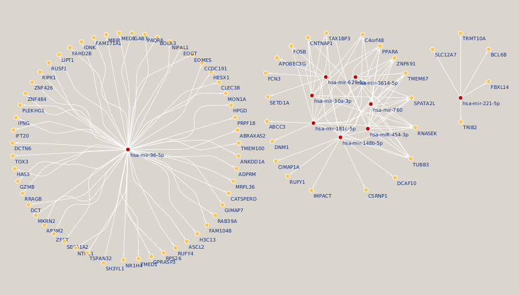
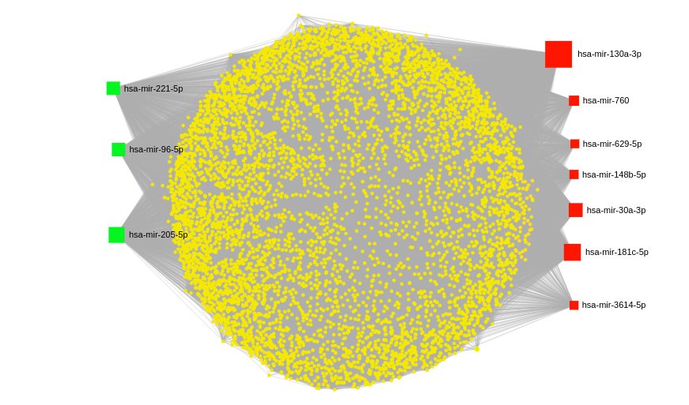
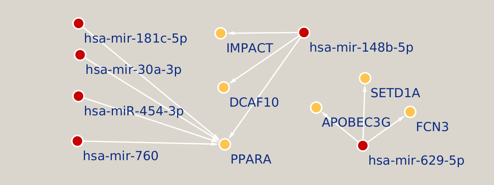

# 🧬 Integrated Analysis of miRNA-mRNA Co-Expression network in dengue virus infection.

## Overview
This project integrates mRNA and miRNA sequencing data to explore the regulatory networks involved in Dengue virus (DENV) infection. By analyzing samples from both DENV-infected and control conditions, we identified significantly altered genes and miRNAs. The regulatory interactions between miRNAs and mRNAs were investigated through Pearson correlation analysis, providing insights into potential therapeutic targets and diagnostic biomarkers.

## 📊 Correlation Networks

### Positive Correlation Network

### miRNA-Gene Correlation

### Negative Correlation Network

## Tools Used:
- **Hisat2**
- **Bowtie2**
- **DESeq2**
- **ggplot2**
- **Python (pandas, matplotlib)**
